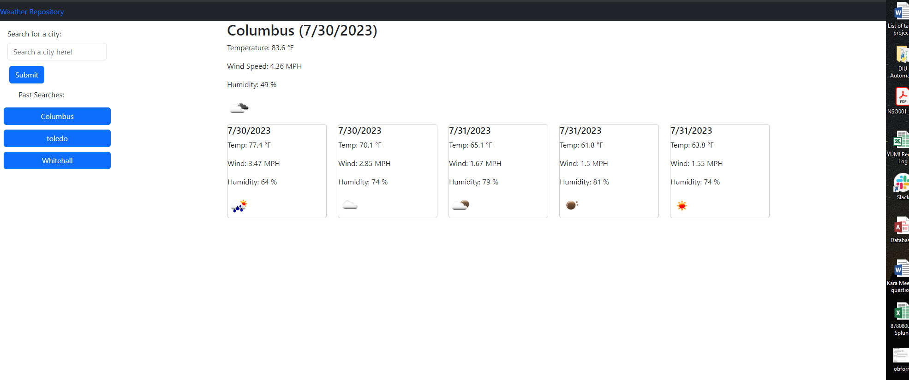

# Weather-Dashboard

## Table of Contents
  -[Description](#description)   
  -[Usage](#usage)   
  -[Screenshot](#screenshot)   
  -[Contribution](#contribution)  
  -[Additional Information](#additional-info)

## Description:
This weather dashboard application allows you to search for current and 5-day forecast weather information for any city. The application retrieves data from the OpenWeatherMap API.

## Usage:
Clone the repository and open up index.html, or open the live link to the site to start exploring weather data for your chosen cities! Previously searched cities are saved and can be clicked on for quick access to their weather information. [Live Link](https://thinker92.github.io/Weather-Repo/)

## Screenshot:

## Contribution:
Create a GitHub issue for this repo or send me an email! 

## Additional Information:
  - GitHub: [Thinker92](https://github.com/Thinker92)
  - Email: vilsonapo@gmail.com

## Author
Vilson Apostolovski II
